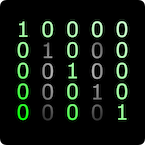

# State Space Sample Contract

<h2 align="center"> Sample Aiken Contract for State Space Modeling  </h2>
<p align="center">
  
</p>
<p align="center">
  
</p>

## About

This is a sample smart contract on Cardano written in Aiken with some sample off-chain code, an automated test case to execute an intended on-chain interaction, a setup script to configure the on-chain test.

Smart contracts on an eUTXO blockchain work by "gating" actions at an address and it's respective policy (unique signature). Transaction validation is split into distinct sets for validation:
* TX Structure
* State


### TX Structure

In this contract, we enforce a close-loop system where the latest state is "spent" and replaced with a new state. This means that the eUTXO holding the state of the contract goes into the TX as an input, and the user must send an input with an appropriately updated state. Contract states on Cardano are referred to as `datums`.

Additionally, to initialize the contract, the user must send an input from their wallet to use as a parameter to guarantee contract uniqueness. This can be learnt in more detail at this blog post: https://piefayth.github.io/blog/pages/aiken1/

### State

The state stepping of the contract is validated depending on the action that is being taken with the contract. Actions are also programatically referred to as `redemeers`. Within this example, we simply show two actions, an increment and a decrement. The actions are wrapped by a category of user type, however in this example, we only have one user.

We don't enforce an initial state in this example, however if you are interested in doing so, the methodology to do so is to mint a token with contract initialization, and use the token as an authentication mechanism for updating the state.

#### State Structure

Our state vector presented below is representative of a 3 degree-of-freedom system. It can be further extended to 6 degrees, or variables can be changed to be more representative of your dynamic model, whatever your heart desires. Initial time is stamped into the state for stepping the model in time at t_0. Additionally, a structure for various parameters is offered, which can serve a variety of purposes such as defining the time step. Hardcoded intervals in Posix time can be found in `lib/statematrix/parameters.ak` for your convenience.

``` aiken
pub type State {
  t_0: PosixTime,
  x: Int,
  y: Int,
  z: Int,
  x_dot: Int,
  y_dot: Int,
  z_dot: Int,
  param: Parameters,
}
pub type Parameters {
  a: Int,                 
  b: Int,                 
  c: Int,
  owner: VerificationKeyHash,
  asset: Asset,
}
```

More about state-space resepresentation can be found here: https://en.wikipedia.org/wiki/State-space_representation

#### Incrementing

In this example, it is simply enforced that `t_0` and `param` are unaltered in each state update, and that `x` must be 10 more than it previously was.

#### Decrementing

As with incrementing, it is enforced that `t_0` and `param` are unaltered in each state update, however that `x` must be 2 less than it previously was.

## Build

To build the contract interface for Lucid-Evo, in the project root directory execute:
```sh
aiken b -t verbose --env preview && aiken blueprint convert -m statematrix > src/scripts/statematrix.json
```

## Testing

### Aiken Validation Logic

To run all aiken test cases, simply do:

```sh
aiken check
```

### On Chain Testing

#### Setup

Run `pnpm install` in the `src` directory to install `node` packages and set up the `.env` file with a set of API keys for Ogmios and Kupo on the Preview network at https://Demeter.run

Then run `./Setup.sh` in the `src/test` directory to set up a wallet and receive guidance on funding it with tADA, and once funded, hit enter to then auto-mint a set of 10,000 test tokens.

#### Run Test Case

Then run to execute the test case. It will initialize the contract, increment it, and decrement it.

`./T1.sh`

